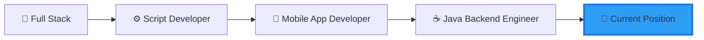

# 👋 Hi there, I'm thisdcw! / 你好，我是 thisdcw！

<div align="center">
  
  [](https://git.io/typing-svg)
  
</div>

## 🌟 About Me / 关于我

**English:**
I'm a passionate software engineer with 2.5 years of professional experience, driven by an insatiable curiosity for coding. Every spare moment is an opportunity to dive deeper into the world of programming. My journey has taken me through diverse roles - from full-stack development to scripting, mobile app development, and now specializing in Java backend engineering.

> 💡 **Philosophy:** Code is poetry, and every bug is a chance to write a better verse.

**中文：**
我是一位充满热情的软件工程师，拥有两年半的专业开发经验。编程不仅是我的职业，更是我的热爱——每一分空闲时间都是探索代码世界的宝贵机会。我的职业历程横跨多个领域：全栈开发、脚本开发、移动应用开发，目前专注于 Java 后端工程。

> 💡 **理念：** 代码即诗歌，每个 bug 都是写出更好诗句的机会。

---

## 🚀 Professional Journey / 职业历程



**Experience Timeline / 经历时间线:**
- 🎯 **Current / 当前**: Java Backend Engineer (Spring Ecosystem) / Java 后端工程师（Spring 生态）
- 📱 **2023-2024**: Mobile App Developer / 移动应用开发
- 🔧 **2022-2023**: Script Development / 脚本开发
- 🌐 **2022**: Full Stack Developer / 全栈开发工程师

---

## 💻 Tech Stack / 技术栈

### Backend / 后端


### Frontend & Mini Program / 前端 & 小程序


### Mobile Development / 移动开发


### Database & Tools / 数据库 & 工具


---

## 📊 GitHub Stats / GitHub 统计

<div align="center">
  
  
  
  
</div>

<div align="center">
  
  
  
</div>

<div align="center">
  
  
  
</div>

---

## 🏆 GitHub Trophies / GitHub 奖杯

<div align="center">
  
  
  
</div>

---

## 🔥 Contribution Heatmap / 贡献热力图

<div align="center">
  
  
  
</div>

---

## 💼 What I'm Currently Focused On / 当前专注方向

```javascript
const thisdcw = {
    currentRole: "Java Backend Engineer",
    currentlyLearning: ["Microservices Architecture", "Cloud Native", "System Design"],
    lookingForHelpWith: ["Open Source Projects", "Best Practices"],
    funFact: "I code with coffee ☕ and debug with more coffee ☕☕",
    
    当前职位: "Java 后端工程师",
    正在学习: ["微服务架构", "云原生", "系统设计"],
    寻求合作: ["开源项目", "最佳实践"],
    趣事: "用咖啡写代码 ☕，用更多咖啡调试代码 ☕☕"
}
```

---

## 🌱 2025 Goals / 2025 年度目标

- 🎯 **English:** Contribute to more open source projects / **中文：** 为更多开源项目做贡献
- 📚 **English:** Deep dive into distributed systems / **中文：** 深入研究分布式系统
- 🚀 **English:** Build and launch personal projects / **中文：** 构建并发布个人项目
- 💡 **English:** Share knowledge through technical blogs / **中文：** 通过技术博客分享知识
- 🤝 **English:** Collaborate with developers worldwide / **中文：** 与全球开发者协作

---

## 📫 Let's Connect / 联系方式

<div align="center">
  
  [](https://github.com/thisdcw)
  [](mailto:your.email@example.com)
  
</div>

---

<div align="center">
  
  ### 💬 "Code is like humor. When you have to explain it, it's bad." - Cory House
  ### 💬 "代码如幽默，需要解释时，就是不好的代码。" - Cory House
  
  
  
  ⭐️ From [thisdcw](https://github.com/thisdcw) with ❤️
  
</div>
