# 👋 Hi there, I'm thisdcw!

<div align="center">
  
  [](https://git.io/typing-svg)
  
</div>

## 🌟 About Me

I'm a passionate software engineer with 2.5 years of professional experience, driven by an insatiable curiosity for coding. Every spare moment is an opportunity to dive deeper into the world of programming. My journey has taken me through diverse roles - from full-stack development to scripting, mobile app development, and now specializing in Java backend engineering.

> 💡 **Philosophy:** Code is poetry, and every bug is a chance to write a better verse.

---

## 🚀 Professional Journey

```mermaid
graph LR
    A[🌱 Full Stack] --> B[⚙️ Script Developer]
    B --> C[📱 Mobile App Developer]
    C --> D[☕ Java Backend Engineer]
    D --> E[🎯 Current Position]
    style E fill:#2e9ef7,stroke:#1a73e8,stroke-width:3px
```



**Experience Timeline:**
- 🎯 **Current**: Java Backend Engineer (Spring Ecosystem)
- 📱 **2023-2024**: Mobile App Developer
- 🔧 **2022-2023**: Script Development
- 🌐 **2022**: Full Stack Developer

---

## 💻 Tech Stack

### Backend


### Frontend & Mini Program


### Mobile Development


### Database & Tools


---

## 📊 GitHub Stats

<div align="center">
  
  
  
  
</div>

<div align="center">
  
  
  
</div>

<div align="center">
  
  
  
</div>

---

## 🏆 GitHub Trophies

<div align="center">
  
  
  
</div>

---

## 🔥 Contribution Heatmap

<div align="center">
  
  
  
</div>

---

## 💼 What I'm Currently Focused On

```javascript
const thisdcw = {
    currentRole: "Java Backend Engineer",
    currentlyLearning: ["Microservices Architecture", "Cloud Native", "System Design"],
    lookingForHelpWith: ["Open Source Projects", "Best Practices"],
    communities: ["Stack Overflow", "GitHub", "Tech Blogs"],
    funFact: "I code with coffee ☕ and debug with more coffee ☕☕"
}
```

---

## 🌱 2025 Goals

- 🎯 Contribute to more open source projects
- 📚 Deep dive into distributed systems and cloud architecture
- 🚀 Build and launch personal projects that solve real problems
- 💡 Share knowledge through technical blogs and tutorials
- 🤝 Collaborate with developers worldwide
- 🏅 Master advanced Spring ecosystem patterns
- 📖 Read 12+ technical books

---

## 📈 Coding Activity

<!--START_SECTION:waka-->
<!--END_SECTION:waka-->

---

## 📫 Let's Connect

<div align="center">
  
  [](https://github.com/thisdcw)
  [](mailto:your.email@example.com)
  [](https://linkedin.com/in/yourprofile)
  
</div>

---

<div align="center">
  
  ### 💬 "Code is like humor. When you have to explain it, it's bad." - Cory House
  
  
  
  ⭐️ From [thisdcw](https://github.com/thisdcw) with ❤️
  
</div>
